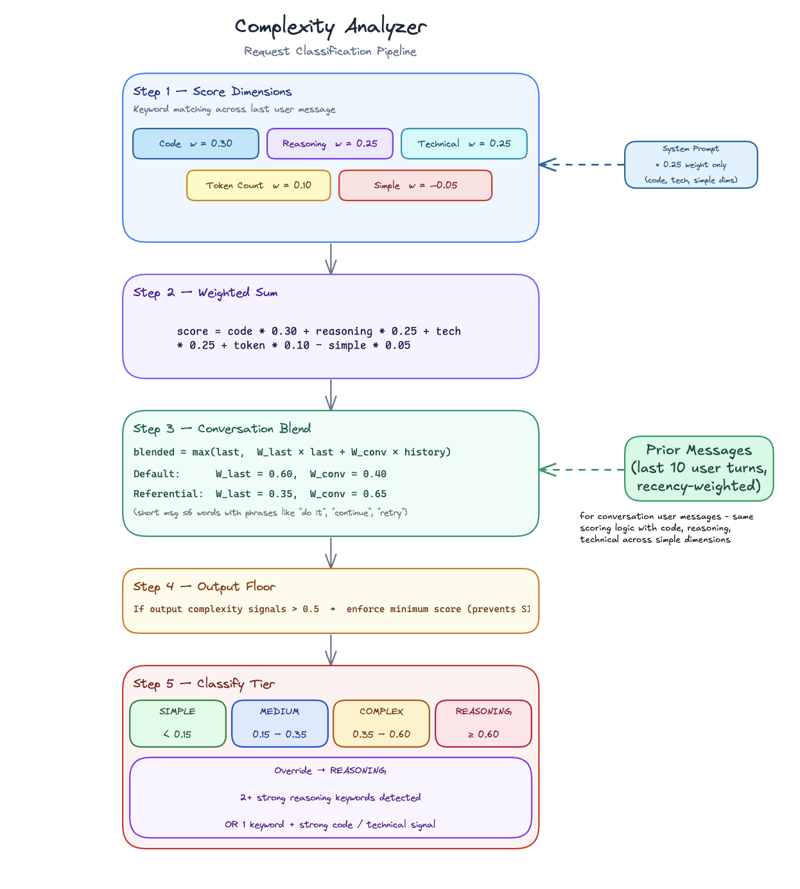
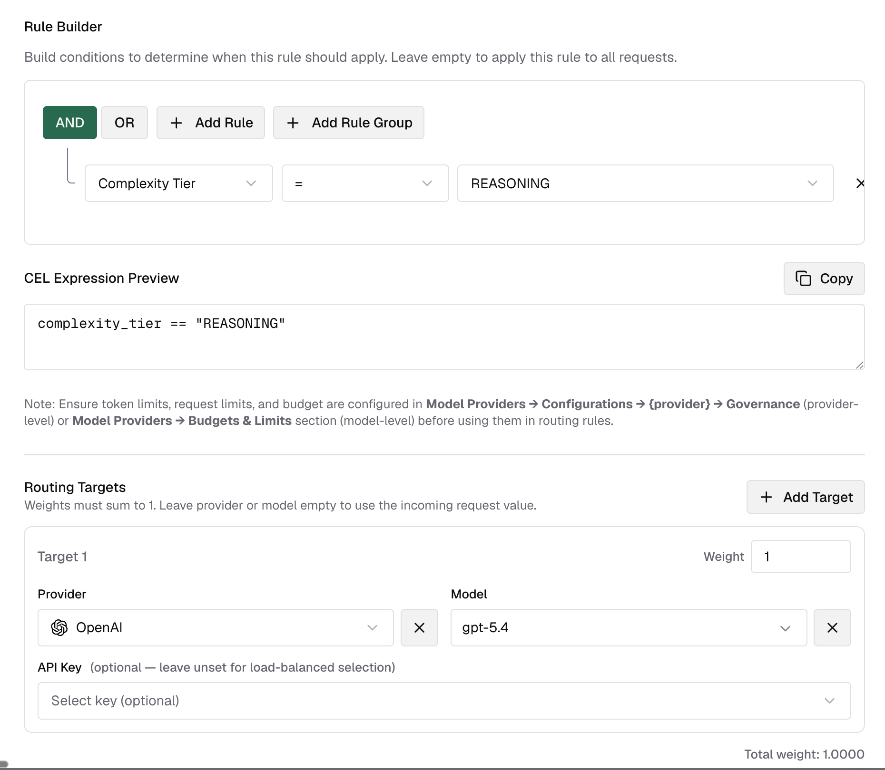
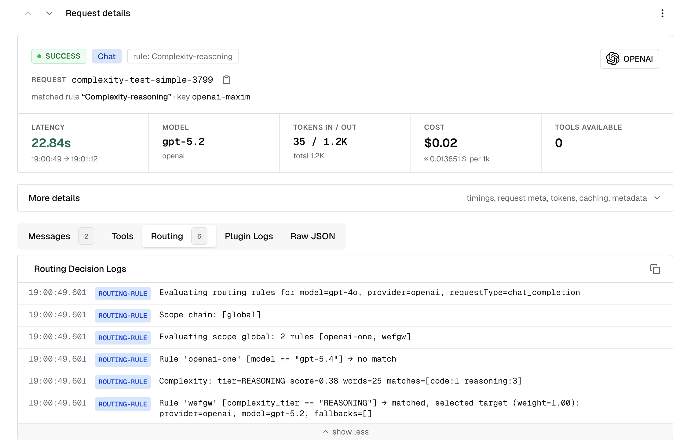

## Overview

The Complexity Router analyzes each incoming request and assigns it one of four tiers - **SIMPLE**, **MEDIUM**, **COMPLEX**, or **REASONING** - based on the content of the latest user message, conversation history, and system prompt. The result is exposed as a flat string variable (`complexity_tier`) in Bifrost's CEL routing engine, so you can write routing rules like:

```cel
complexity_tier == "REASONING"
complexity_tier in ["COMPLEX", "REASONING"]
```

This lets you route simple greetings to a fast, cheap model and deep reasoning tasks to a frontier model — automatically, with no changes to your application code. The algorithm is fast and deterministic: it runs entirely in-process using pre-compiled keyword matching, adds less than 1 ms to request latency, and makes zero external calls.


---

## How it works

### Scoring dimensions

Every request produces a score between 0.0 and 1.0. The analyzer starts with a weighted score across five dimensions detected by scanning the last user message:

| Dimension | Weight | What it measures |
|---|---|---|
| Code presence | 30% | Code, debugging, and programming artifacts |
| Reasoning markers | 25% | Analytical and multi-step reasoning language |
| Technical terms | 25% | Architecture, infra, and operational terminology |
| Token count | 10% | Prompt length (longer → higher score) |
| Simple indicators | −5% | Greetings, trivial queries (dampener, subtracted) |

The simple indicators dimension subtracts from the score - it acts as a dampener, not a floor. This means a short, conversational prompt like "hi, how are you?" can reach a near-zero score even if it technically contains other weak signals. The dampener is reduced to near-zero when the prompt is long (≥30 words) or contains two or more other strong signals, so it does not suppress genuinely complex requests.

### System prompt contribution

The system prompt is scanned for code, technical, and simple signals, and its contribution is weighted at **25% of the user-message signal** for those three dimensions. This provides soft lexical context — for example, a system prompt describing a coding assistant nudges code scores up — but it never drives the token count, reasoning markers, or tier override.

### Conversation context blending

For multi-turn conversations, the score blends the current message with history from up to the last 10 user turns (recency-weighted: earlier turns count less):

- **Default blend:** 60% last message + 40% conversation history
- **Referential follow-up blend:** 35% last message + 65% conversation history

A message is treated as a referential follow-up when it is short (≤6 words), contains phrases like "do it", "retry", "continue", or "go ahead", and the conversation history has a meaningful complexity score. In that case, the follow-up inherits most of its score from prior context rather than being classified as SIMPLE on its own.

The final score is `max(last_message_score, weighted_blend)` — the current message always sets a floor.

### Output complexity floor

Some requests are hard not because the reasoning is especially deep, but because the output being asked for is broad or exhaustive. Prompts like "list every AWS service and explain each one with examples" can receive a built-in score floor even when the normal weighted score is only moderate.

The analyzer looks for internal markers such as exhaustive enumeration ("list every", "all possible"), comprehensiveness cues ("comprehensive", "in detail"), and elaboration asks ("explain each", "with examples"). Limiting qualifiers like "briefly", "top 5", or "keep it short" reduce this boost.

This output-complexity floor is built in — it is not currently exposed as a user-configurable keyword list.

### Reasoning override

When two or more **reasoning keywords** are detected in the last user message, the tier is forced to **REASONING** regardless of the numeric score. The same override applies when one strong reasoning keyword appears alongside strong code or technical signals.

This handles prompts like "step by step, explain why the authentication flow fails" that would score moderately on each individual dimension but clearly require deep reasoning.

### Tier classification

The final score maps to a tier using configurable boundaries (defaults shown):

| Tier | Score range (defaults) | Typical requests |
|---|---|---|
| SIMPLE | < 0.15 | Greetings, definitions, simple lookups |
| MEDIUM | 0.15 – 0.35 | General questions, short explanations |
| COMPLEX | 0.35 – 0.60 | Technical questions, code help, multi-step tasks |
| REASONING | ≥ 0.60 (or override) | Analysis, architecture decisions, root-cause investigation |



---

## Configuration

### Tier boundaries

Adjust where the score thresholds fall to match your traffic and model lineup.

<Tabs group="complexity-config">
<Tab title="Web UI">

Navigate to **Complexity Router** in the sidebar.

The **Complexity Spectrum** bar updates live as you type boundary values, so you can see how your traffic would be distributed before saving.


1. Enter a value between 0 and 1 for each boundary.
2. Boundaries must be strictly increasing: `simple_medium` < `medium_complex` < `complex_reasoning`.
3. Click **Save changes** to apply immediately (hot-reloaded, no restart required).
4. Click **Restore defaults** to reset all boundaries and keyword lists to factory values.

</Tab>
<Tab title="API">

```bash
# Get current configuration
curl http://localhost:8080/api/governance/complexity

# Update tier boundaries
curl -X PUT http://localhost:8080/api/governance/complexity \
  -H "Content-Type: application/json" \
  -d '{
    "tier_boundaries": {
      "simple_medium": 0.15,
      "medium_complex": 0.35,
      "complex_reasoning": 0.60
    },
    "keywords": {
      "code_keywords": ["function", "class", "api", "debug"],
      "reasoning_keywords": ["step by step", "explain why", "tradeoffs"],
      "technical_keywords": ["architecture", "kubernetes", "latency"],
      "simple_keywords": ["hello", "hi", "thanks", "what is"]
    }
  }'

# Reset to factory defaults
curl -X POST http://localhost:8080/api/governance/complexity/reset
```

**Response (GET / PUT):**
```json
{
  "tier_boundaries": {
    "simple_medium": 0.15,
    "medium_complex": 0.35,
    "complex_reasoning": 0.60
  },
  "keywords": {
    "code_keywords": ["function", "class", "..."],
    "reasoning_keywords": ["step by step", "..."],
    "technical_keywords": ["architecture", "..."],
    "simple_keywords": ["hello", "hi", "..."]
  }
}
```

</Tab>
<Tab title="config.json">

```json
{
  "governance": {
    "complexity_analyzer_config": {
      "tier_boundaries": {
        "simple_medium": 0.15,
        "medium_complex": 0.35,
        "complex_reasoning": 0.60
      },
      "keywords": {
        "code_keywords": ["function", "class", "api", "debug", "deploy"],
        "reasoning_keywords": ["step by step", "explain why", "tradeoffs", "root cause analysis"],
        "technical_keywords": ["architecture", "kubernetes", "latency", "authentication"],
        "simple_keywords": ["hello", "hi", "thanks", "what is", "define"]
      }
    }
  }
}
```

| Field | Type | Required | Default | Description |
|---|---|---|---|---|
| `tier_boundaries.simple_medium` | number | Yes | 0.15 | Score threshold between SIMPLE and MEDIUM (exclusive: 0 < value < 1) |
| `tier_boundaries.medium_complex` | number | Yes | 0.35 | Score threshold between MEDIUM and COMPLEX |
| `tier_boundaries.complex_reasoning` | number | Yes | 0.60 | Score threshold between COMPLEX and REASONING |
| `keywords.code_keywords` | string[] | Yes | built-in defaults | Signals for code/debugging/programming requests |
| `keywords.reasoning_keywords` | string[] | Yes | built-in defaults | Strong reasoning triggers — matches can force REASONING tier |
| `keywords.technical_keywords` | string[] | Yes | built-in defaults | Architecture/infra/operations signals |
| `keywords.simple_keywords` | string[] | Yes | built-in defaults | Phrases that dampen the complexity score |

<Note>
Each keyword list requires at least one entry. Keywords are normalized to lowercase and deduplicated on save. Changes are hot-reloaded with no restart required.
</Note>

<Warning>
If `governance.complexity_analyzer_config` is present in `config.json`, the file remains authoritative on restart. UI and API edits apply immediately, but the file values are re-applied on the next startup unless you update `config.json` too.
</Warning>

</Tab>
</Tabs>

### Keyword lists

Each list controls a different part of the scoring signal. Understanding what they do helps you tune routing for your domain.

<Tabs group="complexity-keywords">
<Tab title="Web UI">


Type a keyword or phrase and press **Enter** to add it. Click the × on any tag to remove it. The entry count is shown next to each list label.

</Tab>
<Tab title="About each list">

| List | Effect | When to customize |
|---|---|---|
| **Code keywords** | Each match contributes to the Code dimension (30% weight) | Add domain-specific tooling, frameworks, or file types your users frequently mention |
| **Reasoning keywords** | Strong triggers — two or more matches, or one match alongside strong code/technical signals, forces the REASONING tier regardless of score | Narrow this list to the phrases that truly demand your most capable model. The default list is intentionally conservative. |
| **Technical keywords** | Each match contributes to the Technical dimension (25% weight) | Add industry-specific jargon (e.g. "SOC 2", "HIPAA", "proration") relevant to your product |
| **Simple keywords** | Each match subtracts from the score (dampener) | Add domain-specific phrases that signal trivial intent in your app context |

<Warning>
The **reasoning keywords** list gates the tier-override path, not just scoring. Adding broad terms like "explain" or "analyze" will push many requests to REASONING. Prefer specific multi-word phrases like "step by step" or "root cause analysis".
</Warning>

</Tab>
</Tabs>

---

## Routing with `complexity_tier`

Once the analyzer is configured, use `complexity_tier` as a variable in any CEL routing rule expression. Bifrost evaluates it as a plain string.

`complexity_tier` is not a special standalone rule type. In the Routing Rules builder, it behaves like any other field, so you can combine it with headers, request type, team/customer scope, budgets, and other predicates in the same rule or nested rule group.

### Available operators

| Operator | CEL syntax | Example |
|---|---|---|
| Equal | `==` | `complexity_tier == "REASONING"` |
| Not equal | `!=` | `complexity_tier != "SIMPLE"` |
| In list | `in` | `complexity_tier in ["COMPLEX", "REASONING"]` |
| Not in list | `!(x in [...])` | `!(complexity_tier in ["SIMPLE", "MEDIUM"])` |


### Combining with other rule conditions

You can mix complexity with any other routing condition the CEL builder supports:

```cel
headers["x-tier"] == "premium" && complexity_tier == "REASONING"
headers["x-region"] == "us-east" && complexity_tier in ["COMPLEX", "REASONING"]
request_type == "chat_completion" && complexity_tier != "SIMPLE"
team_name == "ml-research" && headers["x-env"] == "prod" && complexity_tier == "REASONING"
```

### Setting up a complexity-based routing rule

The best first rollout is usually a single **REASONING** rule. It is easy to validate, has the smallest blast radius, and leaves SIMPLE, MEDIUM, and COMPLEX traffic on your existing routing path.

1. Go to **Routing Rules** in the sidebar.
2. Create a new rule and open the CEL builder.
3. Add a condition: field = **Complexity Tier**, operator = **=**, value = **REASONING**.
4. Set the target provider and model to your strongest reasoning model.
5. Save and enable the rule.

Once you are happy with the classifications, add complementary rules for SIMPLE, MEDIUM, and COMPLEX if you want a full tier-based routing ladder. An example is shown below.



### Use case examples

#### Start with a REASONING carve-out

Route only frontier-worthy requests to your strongest model and let everything else keep using your existing routing:

```json
{
  "id": "complexity-reasoning",
  "name": "Reasoning → Frontier model",
  "enabled": true,
  "cel_expression": "complexity_tier == \"REASONING\"",
  "targets": [{ "provider": "anthropic", "model": "claude-opus-4-5", "weight": 1 }],
  "scope": "global",
  "priority": 0
}
```

#### Full four-tier ladder

Route every tier explicitly when you want deterministic model selection across the full spectrum:

```json
[
  {
    "id": "complexity-simple",
    "name": "SIMPLE → Fast model",
    "enabled": true,
    "cel_expression": "complexity_tier == \"SIMPLE\"",
    "targets": [{ "provider": "groq", "model": "llama-3.1-8b-instant", "weight": 1 }],
    "scope": "global",
    "priority": 0
  },
  {
    "id": "complexity-medium",
    "name": "MEDIUM → Balanced model",
    "enabled": true,
    "cel_expression": "complexity_tier == \"MEDIUM\"",
    "targets": [{ "provider": "openai", "model": "gpt-4o-mini", "weight": 1 }],
    "scope": "global",
    "priority": 1
  },
  {
    "id": "complexity-complex",
    "name": "COMPLEX → Strong general model",
    "enabled": true,
    "cel_expression": "complexity_tier == \"COMPLEX\"",
    "targets": [{ "provider": "anthropic", "model": "claude-sonnet-4-5", "weight": 1 }],
    "scope": "global",
    "priority": 2
  },
  {
    "id": "complexity-reasoning",
    "name": "REASONING → Frontier model",
    "enabled": true,
    "cel_expression": "complexity_tier == \"REASONING\"",
    "targets": [{ "provider": "anthropic", "model": "claude-opus-4-5", "weight": 1 }],
    "scope": "global",
    "priority": 3
  }
]
```

#### Roll out to one team first

Test complexity routing with a single team before enabling it globally:

```json
{
  "id": "team-reasoning-pilot",
  "name": "Team pilot — reasoning route",
  "enabled": true,
  "cel_expression": "complexity_tier == \"REASONING\"",
  "targets": [{ "provider": "anthropic", "model": "claude-opus-4-5", "weight": 1 }],
  "scope": "team",
  "scope_id": "team-uuid-456",
  "priority": 0
}
```

---

## Observability

Complexity analysis is recorded in the routing log for every request where analysis ran. In the log detail view, look at the **Routing Decision Logs** section backed by `routing_engine_logs`.



You will see log lines like `Complexity: tier=REASONING score=0.38 words=25 matches=[code:1 reasoning:3]`. This lets you audit how traffic is being distributed and spot mis-classifications to tune thresholds or keyword lists.

---

## Troubleshooting

### Rule not matching when complexity_tier is set

If the routing rule uses `complexity_tier` and the request is not matching, make sure the request contains analyzable user text. A system prompt by itself is not enough — the analyzer needs a text-bearing user prompt to classify.

If analysis is unavailable (for example the body could not be parsed, or the user content is not text-only), `complexity_tier` is treated as **unknown** by the CEL evaluator. The rule does not match and evaluation falls through to the next rule. This is intentional: complexity rules silently degrade rather than blocking requests.

### Which request types are supported

Complexity routing currently runs only for **text-bearing** request families. Supported inputs include:

- Chat Completions and other messages-style requests with text-only user content
- Text Completions requests using `prompt`
- Responses API requests using text-only `input`
- Anthropic Messages, Bedrock Converse, and Gemini `contents` / `systemInstruction` shapes when they carry text-only user input

It does **not** run for:

- Image generation, embeddings, rerank, OCR, audio/speech/transcription, video, or count-tokens requests
- Chat or Responses requests where user content mixes text with image, file, or audio blocks
- Requests that contain only system or developer text and no user text

### All traffic classified as REASONING

The **reasoning keywords** list is the most common cause. Check if any broad single-word terms were added (e.g. "explain", "analyze"). The override gate fires when two or more strong reasoning keywords match — a broad list will trigger it on most prompts. Replace single-word terms with specific multi-word phrases.

### Want to test threshold changes without affecting live traffic

Use the **Discard changes** button to revert unsaved edits, or **Restore defaults** to return to factory settings. Changes only take effect on save.

---

## Next Steps

<CardGroup cols={2}>
  <Card title="Routing Rules" icon="chart-diagram" href="/providers/routing-rules">
    Full reference for CEL expressions, scope hierarchy, and rule chaining
  </Card>
  <Card title="Virtual Keys" icon="key" href="/features/governance/virtual-keys">
    Scope complexity routing rules to specific teams, customers, or virtual keys
  </Card>
  <Card title="Budget & Limits" icon="gauge" href="/features/governance/budget-and-limits">
    Combine complexity routing with budget limits for cost-optimal routing
  </Card>
  <Card title="Provider Routing" icon="route" href="/providers/provider-routing">
    Understand how complexity routing fits into the full request routing pipeline
  </Card>
</CardGroup>
