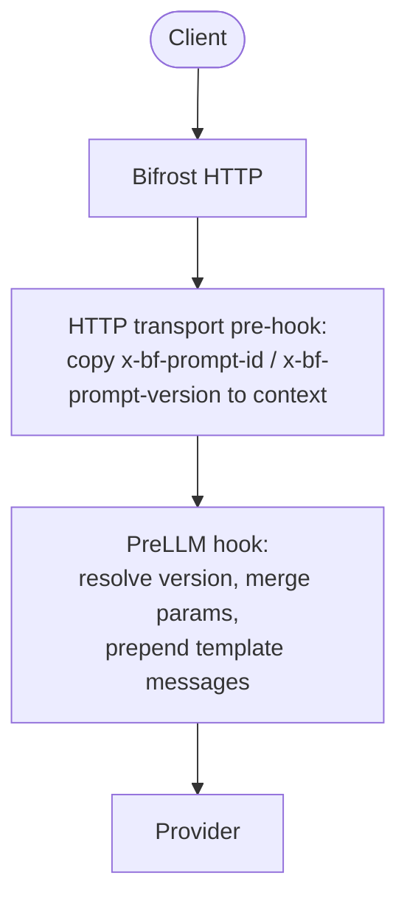

## Overview

The **Prompts** plugin connects the [Prompt Repository](/features/prompt-repository/playground) to inference. It loads committed prompt versions from the config store and **prepends** their messages to **Chat Completions** and **Responses** requests. It also **merges model parameters** from the stored version with the incoming request (request values take precedence).

**What it does:**

- Resolves which prompt and version to apply per request (default: HTTP headers).
- Injects the version’s message history **before** the client’s messages.
- Applies the version’s `model` parameters as defaults, then overrides with whatever the client sent for the same parameters.

---

## Prerequisites

- **Config store** with Prompt Repository tables (typically **PostgreSQL**). File-backed config alone does not store prompts.
- Prompts authored and **committed as versions** in the UI or via the `/api/prompt-repo/...` HTTP API (see `docs/openapi/openapi.yaml` in the repository).
- A **prompt ID** (UUID) for each prompt you reference at runtime. You can read it from the repository API or the playground.

---

## How it works



1. **Transport (HTTP):** Incoming headers `x-bf-prompt-id` and `x-bf-prompt-version` are copied onto the Bifrost context (header name matching is case-insensitive).
2. **Resolve:** The plugin looks up the prompt and the requested version. If **`x-bf-prompt-version` is omitted**, the prompt’s **latest committed version** is used.
3. **Parameters:** Version `model` parameters are merged into the request; any field already set on the request wins.
4. **Messages:** Messages from the committed version are **prepended** to `messages` (chat) or `input` (responses). Your request body adds the user turn(s) after the template.

If the prompt ID is missing, the plugin does nothing and the request passes through unchanged.

---

## HTTP headers (gateway)

| Header | Required | Description |
|--------|----------|-------------|
| `x-bf-prompt-id` | Yes, to enable injection | UUID of the prompt in the repository. |
| `x-bf-prompt-version` | No | **Integer version number** (e.g. `3` for v3). If omitted, the **latest** committed version for that prompt is used. |

Invalid or unknown IDs / versions are logged as warnings; the request is **not** failed by the plugin (it proceeds without template injection).

---

## Example: Chat Completions

Use the same JSON body as a normal chat request. Only the headers select the template.

```bash
curl -X POST http://localhost:8080/v1/chat/completions \
  -H "Content-Type: application/json" \
  -H "x-bf-prompt-id: YOUR-PROMPT-UUID" \
  -H "x-bf-vk: sk-bf-your-virtual-key" \
  -d '{
    "model": "openai/gpt-5.4",
    "messages": [
      {
        "role": "user",
        "content": "Tell me about Bifrost Gateway?"
      }
    ]
  }'
```


When you commit a version from the playground, the model parameters (temperature, max tokens, etc.) are saved with it. These parameters are merged into the outgoing request, with client-supplied values taking precedence.


In **Logs**, that run shows the full conversation: the committed **system** template, your **user** message from the request body, and the assistant reply. The log also displays the **Selected Prompt** name and version number for easy traceability.

The provider receives the merged model parameters from both the prompt version and the client request, with the messages from the committed version prepended before the client’s messages.

---

## Example: Responses API

```bash
curl -X POST http://localhost:8080/v1/responses \
  -H "Content-Type: application/json" \
  -H "x-bf-prompt-id: YOUR-PROMPT-UUID" \
  -H "x-bf-prompt-version: 4" \
  -H "x-bf-vk: sk-bf-your-virtual-key" \
  -d '{
    "model": "openai/gpt-5-nano-2025-08-07",
    "input": "What is Pale Blue Dot?"
  }'
```

---

## Streaming

Streaming is controlled entirely by the client request. If you want streaming, set `"stream": true` in the request body. The plugin merges model parameters from the committed version (request values take precedence), but does **not** override the transport-level streaming mode.

---

## Cache and updates

The plugin keeps an in-memory cache of prompts and versions (loaded with a small number of store queries at startup). When you create, update, or delete prompts or versions through the **gateway APIs**, the server **reloads** that cache so new commits are visible without a full process restart.

---

## Go SDK and custom resolution

For embedded Bifrost (Go SDK), register the plugin with `prompts.Init` and a **config store** that implements the prompt tables API. The default resolver reads the same logical keys from `BifrostContext`:

- `prompts.PromptIDKey` (`x-bf-prompt-id`)
- `prompts.PromptVersionKey` (`x-bf-prompt-version`)

Set them on the context you pass to `ChatCompletion` / `Responses` if you are not going through the HTTP transport hooks.

For advanced routing (for example, choosing a prompt from governance metadata), implement `prompts.PromptResolver` and use **`prompts.InitWithResolver`**. The interface is:

```go
type PromptResolver interface {
    Resolve(ctx *schemas.BifrostContext, req *schemas.BifrostRequest) (promptID string, versionNumber int, err error)
}
```

Return an empty `promptID` to skip injection for a request. Return `versionNumber == 0` to use the prompt's **latest** committed version; any positive integer selects that specific version.

After injection, the plugin sets the following context keys (read by the logging plugin to populate log fields):

- `schemas.BifrostContextKeySelectedPromptID` - UUID of the applied prompt
- `schemas.BifrostContextKeySelectedPromptName` - Display name of the prompt
- `schemas.BifrostContextKeySelectedPromptVersion` - Version number as a string (e.g. `"3"`)

---

## Related

- [Playground](/features/prompt-repository/playground) - create folders, prompts, sessions, and committed versions.
- [Writing Go plugins](/plugins/writing-go-plugin) - plugin interfaces and lifecycle.
- Built-in plugin name in code: `prompts` (`github.com/petehanssens/drover-gateway/plugins/prompts`).
