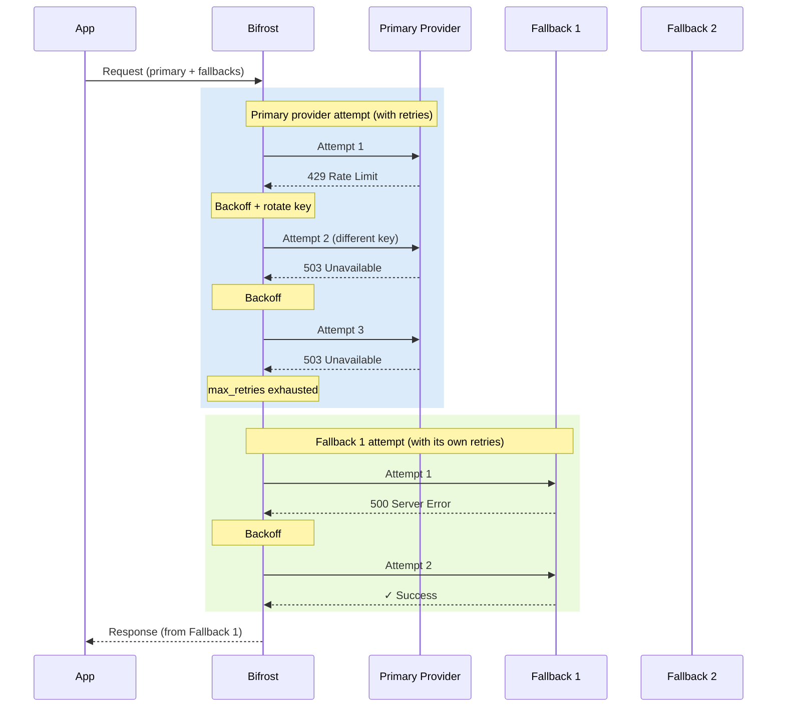

## Overview

Bifrost provides two complementary layers of resilience:

- **Retries** - When a provider returns a transient error (network issue, rate limit, 5xx), Bifrost automatically retries the same request against the same provider with exponential backoff. On rate-limit errors, it can also rotate to a different API key from your pool.
- **Fallbacks** - When the primary provider fails after exhausting all retries, Bifrost moves on to the next provider in your fallback chain. Each fallback provider gets its own full retry budget.

Together, they let you build LLM-powered applications that stay up through rate limits, transient outages, and even full provider failures - with no changes required in your application code.

---

## Retries

### How retries work

When a request fails with a retryable error, Bifrost:

1. Waits using **exponential backoff with jitter** before the next attempt
2. Retries the request against the same provider
3. On **rate-limit errors** (`429`): rotates to a different API key from the pool (if multiple keys are configured) so fresh capacity is used
4. On **network/server errors** (`5xx`, DNS, connection refused): reuses the same key - these are transient server issues, not per-key capacity problems
5. Continues until the request succeeds or `max_retries` is exhausted

### Backoff formula

```
backoff = min(retry_backoff_initial × 2^attempt, retry_backoff_max) × jitter(0.8–1.2)
```

With the defaults of `retry_backoff_initial = 500ms` and `retry_backoff_max = 5000ms`:

| Attempt | Base backoff | With jitter (approx.) |
|---------|-------------|----------------------|
| 1st retry | 500 ms | 400–600 ms |
| 2nd retry | 1000 ms | 800 ms–1.2 s |
| 3rd retry | 2000 ms | 1.6–2.4 s |
| 4th retry | 4000 ms | 3.2–4.8 s |
| 5th+ retry | 5000 ms (capped) | 4–5 s |

### What triggers a retry

| Condition | Retried? | Key rotation? |
|-----------|----------|---------------|
| Network error (DNS, connection refused) | Yes | No - same key reused |
| `5xx` server errors (500, 502, 503, 504) | Yes | No - same key reused |
| Rate limit (`429` or rate-limit message pattern) | Yes | Yes - next key from pool |
| Request validation error | No | - |
| Plugin-enforced block | No | - |
| Cancelled request | No | - |

### Configuring retries

Retries are configured per-provider in `network_config`. The defaults are `max_retries: 0` (no retries), `retry_backoff_initial: 500` ms, and `retry_backoff_max: 5000` ms.

<Tabs group="config-method">
<Tab title="Web UI">

<Frame>
  
</Frame>

Navigate to **Providers**, select a provider, and open the **Network Config** section.

Set:
- **Max Retries** - number of additional attempts after the first failure (e.g. `3`)
- **Retry Backoff Initial** - starting backoff in milliseconds (e.g. `500`)
- **Retry Backoff Max** - maximum backoff cap in milliseconds (e.g. `5000`)

</Tab>
<Tab title="API">

```bash
curl --location 'http://localhost:8080/api/providers' \
--header 'Content-Type: application/json' \
--data '{
    "provider": "openai",
    "keys": [
        {
            "name": "openai-key-1",
            "value": "env.OPENAI_API_KEY",
            "models": ["*"],
            "weight": 1.0
        }
    ],
    "network_config": {
        "max_retries": 3,
        "retry_backoff_initial": 500,
        "retry_backoff_max": 5000
    }
}'
```

</Tab>
<Tab title="Go SDK">

```go
func (a *MyAccount) GetConfigForProvider(provider schemas.ModelProvider) (*schemas.ProviderConfig, error) {
    switch provider {
    case schemas.OpenAI:
        return &schemas.ProviderConfig{
            NetworkConfig: schemas.NetworkConfig{
                MaxRetries:          3,
                RetryBackoffInitial: 500 * time.Millisecond,
                RetryBackoffMax:     5 * time.Second,
            },
            ConcurrencyAndBufferSize: schemas.DefaultConcurrencyAndBufferSize,
        }, nil
    }
    return nil, fmt.Errorf("provider %s not supported", provider)
}
```

</Tab>
<Tab title="config.json">

```json
{
  "providers": {
    "openai": {
      "keys": [
        { "name": "openai-key-1", "value": "env.OPENAI_KEY_1", "models": ["*"], "weight": 1.0 },
        { "name": "openai-key-2", "value": "env.OPENAI_KEY_2", "models": ["*"], "weight": 1.0 },
        { "name": "openai-key-3", "value": "env.OPENAI_KEY_3", "models": ["*"], "weight": 1.0 }
      ],
      "network_config": {
        "max_retries": 3,
        "retry_backoff_initial": 500,
        "retry_backoff_max": 5000
      }
    }
  }
}
```

| Field | Type | Default | Description |
|-------|------|---------|-------------|
| `max_retries` | integer | `0` | Number of additional attempts after the first failure |
| `retry_backoff_initial` | integer (ms) | `500` | Starting backoff duration in milliseconds |
| `retry_backoff_max` | integer (ms) | `5000` | Maximum backoff cap in milliseconds |

</Tab>
</Tabs>

### Key rotation on rate limits

<Note>
Key rotation on retries requires **v1.5.0-prerelease4 or later**.
</Note>

When you configure multiple API keys for a provider, Bifrost automatically rotates to a fresh key when a rate-limit error is encountered - so retries are not wasted repeating a request with a key that has already hit its limit.

```json
{
  "providers": {
    "openai": {
      "keys": [
        { "name": "openai-key-1", "value": "env.OPENAI_KEY_1", "models": ["*"], "weight": 1.0 },
        { "name": "openai-key-2", "value": "env.OPENAI_KEY_2", "models": ["*"], "weight": 1.0 },
        { "name": "openai-key-3", "value": "env.OPENAI_KEY_3", "models": ["*"], "weight": 1.0 }
      ],
      "network_config": {
        "max_retries": 5
      }
    }
  }
}
```

With 3 keys and `max_retries: 5`, Bifrost cycles through all three keys twice before giving up. Once all keys in the pool have been tried, it resets and starts a fresh weighted round.

<Note>
Key rotation on rate limits only applies when `max_retries > 0` and more than one key is configured for the provider. With a single key, all retries reuse that key.
</Note>

---

## Fallbacks

Fallbacks provide automatic failover to a different provider when the primary fails after exhausting all its retries. Each fallback is tried in order until one succeeds.

### How fallbacks work

1. **Primary attempt**: Tries your configured provider with its full retry budget
2. **Fallback decision**: If the primary fails (and the error is retryable at the provider level), Bifrost moves to the first fallback
3. **Sequential fallbacks**: Each fallback provider also gets its own full retry budget
4. **First success wins**: Returns the response from the first provider that succeeds
5. **All fail**: Returns the original error from the primary provider. Exception: if a plugin on a fallback provider sets `AllowFallbacks = false` on the error (e.g. a security or compliance plugin that should halt the chain regardless of remaining fallbacks), Bifrost stops immediately and returns that fallback's error rather than continuing to the next provider or returning the primary error.

Each fallback is treated as a completely fresh request - all configured plugins (semantic caching, governance, logging) run again for the fallback provider.

### Implementation

<Tabs group="fallbacks">
<Tab title="Gateway">

Pass a `fallbacks` array in the request body. Each entry specifies a `provider/model` string:

```bash
curl -X POST http://localhost:8080/v1/chat/completions \
  -H "Content-Type: application/json" \
  -d '{
    "model": "openai/gpt-4o-mini",
    "messages": [
      {
        "role": "user",
        "content": "Explain quantum computing in simple terms"
      }
    ],
    "fallbacks": [
      "anthropic/claude-3-5-sonnet-20241022",
      "bedrock/anthropic.claude-3-sonnet-20240229-v1:0"
    ],
    "max_tokens": 1000,
    "temperature": 0.7
  }'
```

The response `extra_fields.provider` tells you which provider actually served the request:

```json
{
  "id": "chatcmpl-123",
  "object": "chat.completion",
  "choices": [
    {
      "index": 0,
      "message": {
        "role": "assistant",
        "content": "Quantum computing is like having a super-powered calculator..."
      },
      "finish_reason": "stop"
    }
  ],
  "usage": {
    "prompt_tokens": 12,
    "completion_tokens": 150,
    "total_tokens": 162
  },
  "extra_fields": {
    "provider": "anthropic",
    "latency": 1.2
  }
}
```

</Tab>
<Tab title="Go SDK">

```go
package main

import (
    "context"
    "fmt"
    "github.com/petehanssens/drover-gateway"
    "github.com/petehanssens/drover-gateway/core/schemas"
)

func chatWithFallbacks(client *bifrost.Bifrost) {
    ctx := context.Background()

    response, err := client.ChatCompletionRequest(
        schemas.NewBifrostContext(ctx, schemas.NoDeadline),
        &schemas.BifrostChatRequest{
            Provider: schemas.OpenAI,
            Model:    "gpt-4o-mini",
            Input: []schemas.ChatMessage{
                {
                    Role: schemas.ChatMessageRoleUser,
                    Content: &schemas.ChatMessageContent{
                        ContentStr: bifrost.Ptr("Explain quantum computing in simple terms"),
                    },
                },
            },
            // Fallback chain: OpenAI → Anthropic → Bedrock
            Fallbacks: []schemas.Fallback{
                {Provider: schemas.Anthropic, Model: "claude-3-5-sonnet-20241022"},
                {Provider: schemas.Bedrock, Model: "anthropic.claude-3-sonnet-20240229-v1:0"},
            },
            Params: &schemas.ChatParameters{
                MaxCompletionTokens: bifrost.Ptr(1000),
                Temperature:         bifrost.Ptr(0.7),
            },
        },
    )

    if err != nil {
        fmt.Printf("All providers failed: %v\n", err)
        return
    }

    fmt.Printf("Response from %s: %s\n",
        response.ExtraFields.Provider,
        *response.Choices[0].BifrostNonStreamResponseChoice.Message.Content.ContentStr)
}
```

</Tab>
</Tabs>

---

## How retries and fallbacks work together

The two mechanisms form a nested resilience loop. Retries run inside each provider attempt; fallbacks run across providers once retries are exhausted.



**Key point:** each provider in the chain - primary and every fallback - gets its own full `max_retries` budget. A primary configured with `max_retries: 3` and two fallbacks each also configured with `max_retries: 3` means up to 12 total attempts before giving up.

<Info>
The retry budget is set per-provider in `network_config`. If your fallback providers have different retry configurations, each will use their own settings.
</Info>

---

## Real-world scenarios

**Scenario 1: Rate limiting with key rotation**

OpenAI key 1 hits its rate limit. Bifrost rotates to key 2 on the next retry - no fallback needed, the request succeeds within the same provider.

**Scenario 2: Provider outage**

OpenAI is experiencing downtime (returning `503`). Bifrost retries with the same key (transient server issue), exhausts `max_retries`, then fails over to Anthropic. Anthropic succeeds on the first attempt.

**Scenario 3: Cascading failure**

Both primary and first fallback are down. Bifrost works through each provider's retry budget sequentially until the second fallback succeeds.

**Scenario 4: Cost-sensitive fallback**

Primary: a premium model for quality. Fallback: a cost-effective alternative. Governance rules can trigger a budget-exceeded error on the primary, which cascades into the fallback chain.

---

## Plugin execution

When a fallback is triggered, the fallback request is treated as completely new:

- Semantic cache checks run again (the fallback provider may have a cached response)
- Governance rules apply to the new provider
- Logging captures the fallback attempt separately
- All configured plugins execute fresh for each provider in the chain

**Plugin fallback control:** Plugins can prevent fallbacks from being triggered for specific error types. For example, a security plugin might disable fallbacks for compliance reasons. When a plugin sets `AllowFallbacks = false` on the error, the fallback chain is skipped entirely and the original error is returned immediately.

---

## Next steps

- **[Keys Management](./keys-management)** - Configure multiple API keys per provider to enable key rotation on retries
- **[Governance](./governance/virtual-keys)** - Use virtual keys and routing rules to control which providers are used
- **[Observability](./observability/default)** - Track retry counts and fallback usage in your logs
